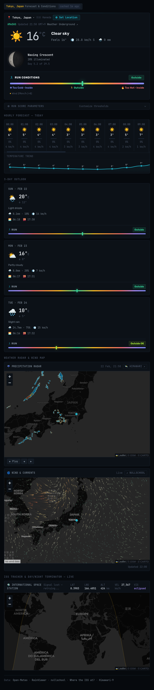
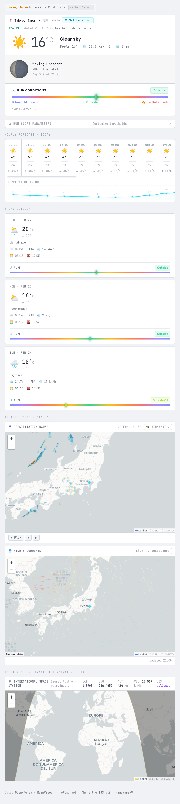

<h1 align="center">WeatherGlass</h1>

<p align="center">
  A self-hosted weather dashboard with real-time conditions, forecasts, radar, wind maps, seismic activity, and ISS tracking — all in a single Flask app.
</p>

> **Fork of [elkentaro/weatherglass](https://github.com/elkentaro/weatherglass)** — full credit to the original author for the dashboard design and core implementation.
>
> **Changes in this fork:**
> - Removed the countdown timer panel and all associated DEF CON theming
> - Replaced the earth.nullschool.net iframe wind map with a proper Leaflet map + leaflet-velocity particle animation — country outlines are now visible alongside live wind data, and the grid adapts to the visible map area
> - Added seismic activity panel (USGS M2.5+ weekly feed, no API key)

<p align="center">
  <a href="CHANGELOG.md">Changelog</a>
</p>

<p align="center">
  
  
  
</p>

---

## Features

- **Current conditions** — temperature, humidity, wind, precipitation, feels-like, WMO weather icons
- **AMeDAS live data** — real-time JMA station observations when located in Japan
- **Hourly forecast** — 24-hour strip with precipitation bars and synced temperature graph
- **3-day outlook** — daily cards with hi/lo temps, rain probability, sunrise/sunset
- **Run conditions gauge** — configurable scoring system for outdoor running suitability
- **Precipitation radar** — animated RainViewer overlay with playback controls
- **Wind & currents map** — Leaflet map with live wind particle animation via leaflet-velocity
- **Seismic activity panel** — nearby M2.5+ earthquakes from the USGS weekly feed, sorted by distance with magnitude colour coding, depth, and time ago
- **ISS tracker** — real-time orbital position, trail, day/night terminator
- **Moon phase** — photorealistic canvas-rendered moon with illumination data
- **Dark / Light theme** — toggle between dark and light mode, persists across sessions
- **°C / °F toggle** — switch temperature units globally
- **Configurable location** — paste a Google Maps URL or enter coordinates manually

## Screenshots

| Dark Mode | Light Mode |
|:-:|:-:|
|  |  |


---

## Quick Start

```bash
git clone https://github.com/7ang0n1n3/weatherglass.git
cd weatherglass

uv run python app.py
```

Open **http://localhost:5099** — default location is Tokyo Hino-shi, Japan (35.6790, 139.3935). Click **⚙ Set Location** to change it.

---

## Configuration

All configuration is done through the browser UI and persisted in `localStorage`:

| Setting | How to change |
|---|---|
| **Location** | Click "⚙ Set Location" → paste a Google Maps URL or enter lat/lng |
| **Temperature unit** | Click °C/°F toggle in the top bar |
| **Theme** | Click ☀️/🌙 toggle in the top bar |
| **Run thresholds** | Expand "Run Score Parameters" panel |

### Google Maps URL Parsing

The location modal accepts Google Maps URLs in these formats:
- `https://www.google.com/maps/place/.../@35.6762,139.6503,14z`
- `https://www.google.com/maps?q=48.8566,2.3522`
- URLs with `!3d...!4d...` data parameters

---

## Production Deployment

### Docker (Portainer / Docker Compose)

The included `docker-compose.yml` uses a stock `python:3.12-slim` image — no build step required. On startup the container clones the repo from GitHub, installs dependencies with `uv`, and runs the app. The quote cache is persisted in a named Docker volume.

```bash
docker compose up -d
```

Or paste the contents of `docker-compose.yml` directly into Portainer as a new stack.

To pick up new code from GitHub, simply restart the container — it re-clones on every startup.

**Changing the port:** edit the `ports` mapping in `docker-compose.yml`:

```yaml
ports:
  - "5099:5099"
```

---

### Install as a systemd service

```bash
# 1. Create a service user
sudo useradd -r -s /usr/sbin/nologin weatherglass

# 2. Copy files
sudo mkdir -p /opt/weatherglass
sudo cp -r app.py pyproject.toml uv.lock templates/ static/ /opt/weatherglass/
sudo chown -R weatherglass:weatherglass /opt/weatherglass

# 3. Create the venv and sync dependencies
sudo -u weatherglass uv sync --project /opt/weatherglass

# 4. Install and enable the service
sudo cp weatherglass.service /etc/systemd/system/
sudo systemctl daemon-reload
sudo systemctl enable --now weatherglass

# 5. Verify
sudo systemctl status weatherglass
journalctl -u weatherglass -f
```

The dashboard will be available at `http://<your-server>:5099`.

### Changing the port

Edit the last line of `app.py`:

```python
app.run(host="0.0.0.0", port=8080, debug=False)
```

### Reverse proxy (nginx)

```nginx
server {
    listen 80;
    server_name weather.example.com;

    location / {
        proxy_pass http://127.0.0.1:5099;
        proxy_set_header Host $host;
        proxy_set_header X-Real-IP $remote_addr;
        proxy_set_header X-Forwarded-For $proxy_add_x_forwarded_for;
        proxy_set_header X-Forwarded-Proto $scheme;
    }
}
```

---

## Project Structure

```
weatherglass/
├── app.py                  # Flask backend — API proxies + caching
├── templates/
│   └── weather.html        # Single-page frontend (CSS + JS inline)
├── docker-compose.yml      # Docker / Portainer deployment
├── weatherglass.service    # systemd unit file
├── pyproject.toml          # Project metadata + dependencies
├── uv.lock                 # Locked dependency versions
├── LICENSE
└── README.md
```

---

## API Endpoints

| Endpoint | Description |
|---|---|
| `GET /` | Dashboard |
| `GET /api/weather?lat=&lng=&tz=` | Open-Meteo forecast (cached 10 min) |
| `GET /api/amedas?lat=&lng=` | JMA AMeDAS station data (Japan only, cached 5 min) |
| `GET /api/windgrid?lat=&lng=&n=&s=&e=&w=` | Wind vector grid for leaflet-velocity (cached 10 min) |
| `GET /api/earthquakes?lat=&lng=` | USGS M2.5+ earthquakes within 1500 km (cached 10 min) |
| `GET /api/iss` | ISS position (cached 15 sec) |
| `GET /api/timezone?lat=&lng=` | Timezone lookup via Open-Meteo |
| `GET /api/health` | Connectivity check — tests all upstream APIs |

All endpoints accept `lat` and `lng` query parameters, defaulting to Tokyo Hino-shi, Japan (35.6790, 139.3935).

### Health Check

Hit `/api/health` to diagnose connectivity issues. Returns status, latency, and response size for each upstream API:

```json
{
  "open-meteo":        {"ok": true, "status": 200, "ms": 342},
  "rainviewer":        {"ok": true, "status": 200, "ms": 198},
  "iss":               {"ok": true, "status": 200, "ms": 567},
  "jma-amedas":        {"ok": true, "status": 200, "ms": 89},
  "usgs-earthquakes":  {"ok": true, "status": 200, "ms": 361}
}
```

---

## Data Sources

| Source | Provides |
|---|---|
| [Open-Meteo](https://open-meteo.com) | Forecast data (current, hourly, daily) |
| [JMA AMeDAS](https://www.jma.go.jp/bosai/amedas/) | Real-time station observations (Japan) |
| [RainViewer](https://www.rainviewer.com) | Global precipitation radar tiles |
| [leaflet-velocity](https://github.com/onaci/leaflet-velocity) | Wind particle animation layer |
| [Where the ISS at?](https://wheretheiss.at) | ISS orbital position |
| [Weather Underground](https://www.wunderground.com) | External weather link |
| [Himawari-9](https://himawari.asia/) | Satellite imagery link |
| [USGS Earthquake Hazards](https://earthquake.usgs.gov) | M2.5+ earthquake feed (no API key required) |

---

## Tech Stack

**Backend:** Python 3.10+, Flask, Requests

**Frontend:** Vanilla JS, CSS custom properties, Leaflet + Leaflet Terminator + leaflet-velocity

**Fonts:** JetBrains Mono (Google Fonts CDN)

**Maps:** CARTO basemap tiles (dark + light variants)

---

## Troubleshooting

| Symptom | Fix |
|---|---|
| Dashboard shows "Loading..." forever | Check `/api/health` — likely a blocked outbound connection |
| AMeDAS shows "unavailable" | Normal outside Japan. AMeDAS only works within JMA's coverage area |
| Radar map is blank | RainViewer API is fetched client-side — check browser console for CORS or network errors |
| Clock shows wrong time | Click "⚙ Set Location" and re-save — timezone is auto-detected from coordinates |

---

## License

[MIT](LICENSE)
